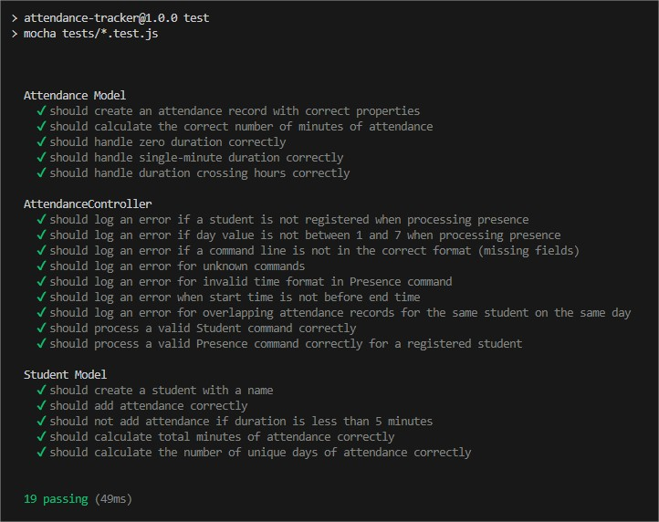

# Attendance Tracker

Aplicación para gestionar y verificar la asistencia de estudiantes, con soporte (opcional) para persistencia con Redis o PostgreSQL.

## Tabla de Contenidos

- [Descripción](#descripción)
- [Características](#características-principales)
- [Requisitos Previos](#requisitos-previos)
- [Dependencias Utilizadas](#dependencias-utilizadas)
- [Instalación](#instalación)
- [Configuración](#configuración)
- [Uso](#uso)
- [Estructura del Proyecto](#estructura-del-proyecto)
- [Pruebas](#pruebas)
- [Comentarios Generales](#comentarios-generales)


## Descripción

Este ejercicio se trata de una aplicación para registrar y contabilizar la asistencia de estudiantes según la información suministrada en un archivo input. 

A modo de prueba se ha hecho utilizando Node.js. 

Sólo con la finalidad de mostrar la flexibilidad que ofrece la arquitectura MVC y el modelo de "carpetización" escogido para la solución, se ofrece a los usuarios la opción de manjear la información del archivo input directamente en memoria o bien persistiendo los datos usando Redis o PostgreSQL (estas últimas dos opciones no están 100% funcionales, sólo está el armando lógico de las funcionalidades a modo de ejemplo).

La aplicación lee un archivo de entrada (input.txt) con comandos de asistencia y genera, después de recorrerlo, un informe detallado.

## Características principales

- Soporte para DIFERENTES MÉTODOS DE PERSISTENCIA: Redis, PostgreSQL o almacenamiento en memoria.
- VALIDACIÓN DE DATOS de entrada (formato de tiempo, solapamiento de horarios, etc.).
- REGISTRO DE ERRORES en un archivo de log.
- Implementación utilizando principios SOLID, arquitectura MVC y TDD.

## Requisitos Previos

- Node.js (versión 14 o superior)

## Dependencias utilizadas

- dotenv (Para manejo de variables de entorno)
- pg (Para persistencia de datos - PostgreSQL)
- readline (Para lectura desde teclado)
- redis (Para persistencia de datos - Redis)
- chai (Para testing)
- mocha (para testing)
- fs (Para lectura/escritura de archivos físicos - Log e Input)
- path (Para manejo de rutas físicas de archivos)

## Instalación

1. Clona el repositorio:

    ```bash
    git clone https://github.com/gtocuyo/foris.git
    cd attendance-tracker
    ```

2. Instala las dependencias:

    ```bash
    npm install
    ```

3. Configura las variables de entorno en un archivo `.env` en la raíz del proyecto:

    ```bash
    # .env

    # Configuración de Redis
    REDIS_HOST=your-redis-host
    REDIS_PORT=your-redis-port

    # Configuración de PostgreSQL
    POSTGRES_USER=your-user-name
    POSTGRES_PASSWORD=your-password
    POSTGRES_DB=your-db-name
    POSTGRES_HOST=your-pg-host
    POSTGRES_PORT=your-pg-port
    ```

## Configuración

- Asegúrate de que PostgreSQL y Redis (si están siendo utilizados) estén corriendo en tu entorno.
- Configura el archivo `.env` correctamente con tus credenciales de base de datos.

## Uso

1. ARCHIVO INPUT:

    - Debes crear o tener un archivo con los comandos a procesar, este archivo DEBE LLAMARSE 'input.txt', si decides utilizar otro nombre, debes indicarlo en el archivo package.json en el script 'START'.
    - El archivo input.txt debe estar ubicado en la carpeta 'inputs' de la raíz del proyecto.

2. EJECUCIÓN DE LA APLICACIÓN:

```bash
npm start
```

3. SIGUE LAS INSTRUCCIONES en la consola para seleccionar la opción de persistencia.

   - OJO, el desarrollo funciona al 100% para la modalidad 0 (memoria), por lo que debes seleccionar esta opción, de lo contrario la ejecución terminará. Las opciones de persistencia están creadas sólo a modo ilustrativo para exponer (en el código fuente) cómo se podría fácilmente enriquecer la funcionalidad.

## Estructura del Proyecto

```plaintext
/project-root
  
  ├── app.js                # Punto de entrada de la aplicación
  
  ├── controllers           # Controlador(es) de la aplicación
  │   └── attendanceController.js
  
  ├── models                # Modelo(s) de datos
  │   ├── student.js
  │   └── attendance.js
  
  ├── services              # Servicio(s) para lógica de la aplicación y persistencia y log de errores
  │   ├── attendanceService.js
  │   ├── logService.js
  │   └── persistenceService.js
  
  ├── views                 # Vista(s) para la salida de datos
  │   └── reportView.js
  
  ├── db                    # Configuración de bases de datos para distintos proveedores
  │   ├── redisClient.js
  │   └── postgresClient.js
  
  ├── tests                 # Pruebas unitarias
  │   ├── student.test.js
  │   ├── attendance.test.js
  │   └── attendanceController.test.js
  
  ├── inputs                # Directorio para archivo de input
  │   └── input.txt
  
  ├── .env                  # Variables de entorno
  
  └── README.md             # Info. General de la aplicación
```

## Pruebas

Las pruebas se ejecutan con MOCHA. para iniciar la ejecución sólo invoca el script TEST:
    
```bash
npm test
```

Se desarrollaron 19 casos de prueba en total, repartidos entre los archivos:
- attendance.test.js (modelo)
- student.test.js (modelo)
- attendanceController.test.js (Controlador)

Para tu referencia, los casos de prueba consideran lo siguiente:

### attendanceController.test.js

1. Debe loguearse un mensaje de ERROR si se intenta registar una asistencia sin antes haber registrado al estudiante.
2. Debe loguearse un mensaje de ERROR si se intenta registrar una asistencia con un valor para el día que no esté entre 1 y 7.
3. Debe loguearse un mensaje de ERROR si la estructura de un comando de asistencia no tiene los valores esperados.
4. Debe loguearse un mensaje de ERROR si se detecta un comando desconocido (diferente de 'Student' o 'Presence'). [IMPORTANTE]
5. Debe loguearse un mensaje de ERROR si la hora de inicio o fin encontrada para registrar una asistencia tiene valores incorrectos.
6. Debe loguearse un mensaje de ERROR si la hora de inicio no es menor a la hora fin al registrar una asistencia.
7. Debe loguearse un mensaje de ERROR si al intentar registrar una asistencia se detecta un solapamiento de hora con una asistencia ya registrada para el mismo estudiante. [IMPORTANTE]
8. Se debe procesar correctamente un comando 'Student' válido.
9. Se debe procesar correctamente un comando 'Presence' válido.

### attendance.test.js

1. Se debe crear correctamente un registro de asistencia.
2. Se debe calcular correctamente la cantidad de minutos de una asistencia.
3. Se debe manejar correctamente una asistencia de 0 minutos (Por el constraint anterior de que la hora inicio debe ser menor a la hora fin)
4. Se debe manejar correctamente una asistencia de duración de un sólo dígito.
5. Se debe manejar correctamente la duración de una asistencia cuando traspasan las horas (por el tema del formato HH:MM y que MM para hora fin sea menor que los MM de hora inicio). [IMPORTANTE]

### student.test.js

1. Se debe registrar correctamente un estudiante a partir de su nombre.
2. Se debe agregar una asistencia correctamente.
3. NO se debe registrar una asistencia si la duración es menor a 5 minutos.
4. Se debe calcular correctamente el total de minutos de una asistencia.
5. Se debe calcular correctamente el número de días únicos de asistencia.



## Comentarios Generales

### 1. ¿Por qué TDD?

La elección de un enfoque de desarrollo guiado por pruebas (TDD, por sus siglas en inglés) se justifica por su capacidad para mejorar la calidad y la fiabilidad del software desde las etapas iniciales de desarrollo. 

TDD implica escribir primero las pruebas que definen el comportamiento esperado del código antes de implementar la funcionalidad correspondiente, lo que ayuda a garantizar que cada componente del sistema funcione correctamente desde el principio. 

Este enfoque no solo facilita la detección temprana de errores, reduciendo así los costos de corrección, sino que también fomenta un diseño más limpio y desacoplado, ya que nos "obliga" a pensar en los requisitos y el comportamiento del sistema de manera más estructurada y concisa.

### 2. Sobre las opciones de persistencia...

Se contemplan tres enfoques, de los cuales para cumplir con el funcioamiento del ejercicio se implementó al 100% sólo el de utilizar un objeto en memoria (arreglo) para almanecer "on-the-fly" los datos del archivo input y contabilizar las permanencias.

A modo ilustrativo, se desarrolla también la lógica para implementar la persistencia de los datos trabajados por la aplicación o bien en Redis o en PostgreSQL, sólo para mostrar lo sencillo que resulta expandir la funcionalidad, en caso de ser necesario, gracias al uso de MVC y al esquema de carpetización aplicado en la solución.

En general en cuanto a los tres enfoques podemos tener en cuenta que: 

La persistencia en memoria local es el enfoque más sencillo y rápido en términos de acceso a datos, ideal para pruebas y desarrollos iniciales, pero carece de persistencia real ya que los datos se pierden al reiniciar la aplicación, lo que lo hace inadecuado para soluciones productivas. 

Redis, como almacenamiento en memoria, ofrece persistencia temporal con alta velocidad de lectura y escritura, adecuado para aplicaciones que requieren acceso rápido a datos volátiles o cachés. Sin embargo, Redis no está diseñado para almacenamiento a largo plazo, y la persistencia de datos puede no ser completa en caso de fallos.

PostgreSQL, en cambio, proporciona una persistencia robusta y segura con capacidades avanzadas de gestión de datos, ideal para aplicaciones que requieren integridad, consistencia y operaciones complejas de consulta. La desventaja de PostgreSQL es que puede ser más lento en comparación con Redis para ciertas operaciones debido a su naturaleza de almacenamiento en disco y la sobrecarga de transacciones.

Para una versión productiva (real) de este ejercicio, con un procesamiento masivo de registros (archivo input extenso), aunque la alternativa más adecuada depende de múltiples factores, probablemente pensar en Redis sería lo más conveniente (si es que no se precisa para ninguna reportería posterior, persistir los datos de las asistencias a largo plazo).

### 3. ¿Por qué MVC para la arquitectura?

La decisión de utilizar la arquitectura MVC (Modelo-Vista-Controlador) en este ejercicio se fundamenta en su capacidad para separar claramente las responsabilidades del sistema, mejorando así la organización y mantenibilidad del código. 

MVC permite, como bien sabemos, dividir la aplicación en tres componentes principales: el Modelo, que maneja la lógica de datos y las reglas de negocio; la Vista, que gestiona la presentación y la interfaz de usuario; y el Controlador, que actúa como intermediario entre el modelo y la vista, gestionando las solicitudes del usuario y orquestando la interacción con los datos al aplicar consideraciones lógicas que garanticen el funcionamiento esperado de la aplicación. 

Esta separación promueve un desarrollo más modular y escalable, facilita las pruebas unitarias, y en general permite que diferentes partes del equipo trabajen en paralelo sin interferencias.

### 4. ¿Qué se trata de resolver realmente?

Lo que aborda este ejercicio es el manejo consistente y efectivo de una estructura de datos compleja (anidada) que debe inicializarse y modificarse recurrentemente a partir de las instrucciones indicadas en el archivo de entrada (input.txt). Luego cuando termine de procesarse el archivo input, se necesita manejar la estructura de datos creada para totalizar según ciertas reglas de negocio las asistencias de los alumnos.

A contnuación se muestra en la imagen la dinámica esperada:

### 5. ¿Cómo se hace?
